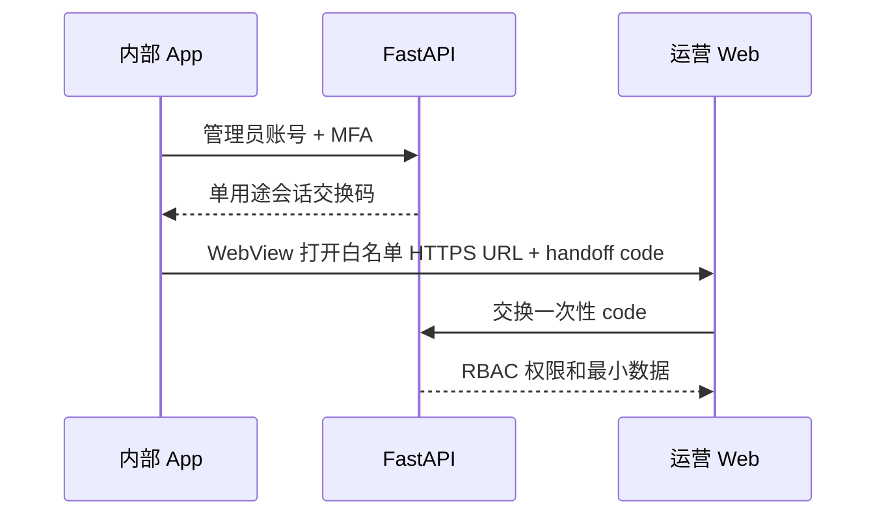

# 运营平台架构边界

日期：2026-07-25

状态：架构已确认，待基础框架实现

## 组成

```text
english-room-op/
├── apps/
│   └── web/               # React Web 运营管理站
└── docs/
    └── architecture.md
```

运营 UI 使用 React Web，由公开 App 的通用 WebView 容器加载。运营仓库只负责 Web 应用和部署配置，不把运营页面源码打进 App；WebView 使用白名单 HTTPS URL 访问运营站。

## 构建隔离

| 变体 | 代码来源 | 分发 | 运营入口 |
| --- | --- | --- | --- |
| `production` | 仅公开 App 仓库 | App Store / Play Store | 不存在 |
| `internal-ops` | 公开 App + 通用 WebView 容器 | Ad Hoc、TestFlight 内测或企业分发 | 存在 |

运营平台实现不会进入公开仓库，也不会依赖正式包中的隐藏手势作为安全边界。

## 访问流程



运营 Web 只调用 FastAPI 管理 API。Sentry 查询由 FastAPI 使用服务端 Token 完成，Web 只接收展示所需的错误摘要、趋势和安全跳转信息。MVP 不实现 URL 加密；HTTPS、白名单、一次性交接码、服务端会话、RBAC 和审计才是安全边界，长期 Token 不进入 URL、WebView 或 App 配置。

## V1 页面

1. 总览：DAU、增长率、D1/D7 留存和核心转化率。
2. 稳定性：错误趋势、受影响用户、版本分布和 Replay 跳转。
3. 房间：成员、连接、录制和房间生命周期。
4. 评分：玩家任务状态、失败原因和受控重试。
5. 审计：管理员登录、查询和写操作记录。

## 权限

- `viewer`：只读指标、房间和错误摘要。
- `operator`：在只读能力外，可重试允许重试的任务。
- `admin`：管理运营账号和角色，不直接修改业务数据。

V1 不提供任意 SQL、任意后端命令、批量修改用户数据或直接读取私有音频。
