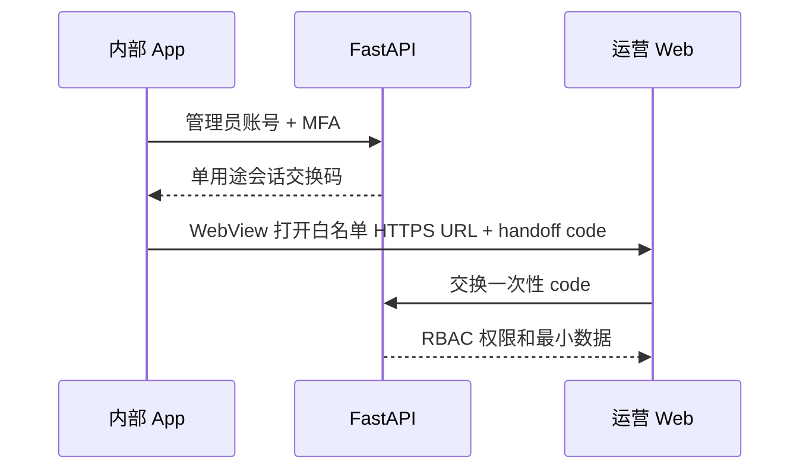

# 运营平台架构边界

日期：2026-07-27

状态：**Phase 1（运营 Web 骨架 + API 客户端适配器）已实现**；真实 admin 数据、认证与 Sentry 代理仍为 **Phase 2**（依赖 `english-room-backend`）。

## 组成

```text
english-room-op/
├── apps/
│   └── web/               # React Web 运营管理站（Vite + React Router）
└── docs/
    └── architecture.md
```

运营 UI 使用 React Web，由公开 App 的通用 WebView 容器加载。运营仓库只负责 Web 应用和部署配置，不把运营页面源码打进 App；WebView 使用白名单 HTTPS URL 访问运营站。

## 实现阶段

### Phase 1（本仓库，当前）

- 五页只读/操作 UI 骨架：总览、稳定性、房间、评分、审计（路由 `/`、`/stability`、`/rooms`、`/scoring`、`/audit`）。
- `OpsApiClient` 接口 + `MockOpsApiClient`（默认）+ `HttpOpsApiClient`（含可注入 admin 头与 `useOpsQuery` / `OpsQueryStatus` 联调壳）。
- 环境切换：`VITE_OPS_API_MODE=http` 且配置 `VITE_OPS_API_BASE_URL` 时选用 HTTP 适配器；否则 Mock。
- 单元测试覆盖 Mock/HTTP 客户端、HTTP 头注入与页面 loading/error/重试；`typecheck` / `lint` / `build` 可在 CI 或本地验证。

**边界说明：** Phase 1 完成的是 **Web 到 HTTP 的客户端映射**，不承诺后端已可用、不连接真实 DAU/Sentry/房间/评分/审计数据。

### Phase 2（`english-room-backend` + 联调，未开始）

- FastAPI 实现 `/admin/v1/*`（与 `HttpOpsApiClient` 路径对齐，最终以 OpenAPI 为准）。
- 管理员 MFA、RBAC、审计日志持久化与服务端会话。
- Sentry 查询经 FastAPI 代理；Web 不持有 Sentry 管理 Token。
- App WebView 白名单 URL + 一次性 handoff 码交换运营会话。

截至当前，`english-room-backend` **没有** `/admin/v1` 路由及上述能力；运营 Web 的 HTTP 模式仅用于未来联调或本地 mock API，**不能**宣称可查看真实线上数据。

## 数据访问层（`apps/web`）

```text
createOpsApiClient()
  ├─ VITE_OPS_API_MODE=http 且 baseUrl 非空 → HttpOpsApiClient
  └─ 否则 → MockOpsApiClient → mock-ops-data.ts
```

`HttpOpsApiClient` 映射（客户端合约，后端待实现）：

- HTTP 响应体为 FastAPI admin **snake_case wire**（如 `data_source`、`unique_user_ids`、`items`）；`ops-admin-wire-mappers.ts` 在客户端边界转换为页面使用的 **camelCase UI 类型**（`dataSource`、`rooms`、`tasks`、`entries`）。Mock 模式仍直接返回 `demo` 结构，不经 wire 映射。
- HTTP 模式仍需 `Authorization` / `X-Admin-MFA` / `X-Admin-Role` 等 admin 头，由 Backend RBAC 校验。

| OpsApiClient 方法 | HTTP |
| --- | --- |
| `getOverviewMetrics` | GET `/admin/v1/metrics/overview` |
| `getStabilitySummary` | GET `/admin/v1/metrics/stability` |
| `listRooms` | GET `/admin/v1/rooms` |
| `listScoringTasks` | GET `/admin/v1/scoring` |
| `retryScoringTask` | POST `/admin/v1/scoring/{taskId}/retry` |
| `listAuditLog` | GET `/admin/v1/audit/events` |

OpenAPI 由后端发布后为接口真相源；不兼容变更使用新版本路径，并在各仓库分别迁移。

### Admin HTTP 头（联调合约，Backend 校验）

| 头 | 用途 |
| --- | --- |
| `Authorization` | 管理员会话或 Bearer（具体格式由 Backend OpenAPI 定义） |
| `X-Admin-MFA` | MFA 步骤完成后的证明；**Phase 2 前**仅用于 staging/本地联调 |
| `X-Admin-Role` | RBAC 角色 hint（`viewer` / `operator` / `admin`） |

运营 Web 通过 `HttpOpsApiClient` 选项或 `VITE_OPS_ADMIN_*` 环境变量注入上述头，不在源码中写入真实凭证。响应体应包含 `dataSource`（`backend` | `placeholder` | Mock 为 `demo`）供页面标注数据来源。

## 构建隔离

| 变体 | 代码来源 | 分发 | 运营入口 |
| --- | --- | --- | --- |
| `production` | 仅公开 App 仓库 | App Store / Play Store | 不存在 |
| `internal-ops` | 公开 App + 通用 WebView 容器 | Ad Hoc、TestFlight 内测或企业分发 | 存在 |

运营平台实现不会进入公开仓库，也不会依赖正式包中的隐藏手势作为安全边界。

## 访问流程（Phase 2 目标）



运营 Web 只调用 FastAPI 管理 API。Sentry 查询由 FastAPI 使用服务端 Token 完成，Web 只接收展示所需的错误摘要、趋势和安全跳转信息。MVP 不实现 URL 加密；HTTPS、白名单、一次性交接码、服务端会话、RBAC 和审计才是安全边界，长期 Token 不进入 URL、WebView 或 App 配置。**该流程尚未在代码中落地。**

## V1 页面

1. 总览：DAU、增长率、D1/D7 留存和核心转化率。
2. 稳定性：错误趋势、受影响用户、版本分布和 Replay 跳转。
3. 房间：成员、连接、录制和房间生命周期。
4. 评分：玩家任务状态、失败原因和受控重试。
5. 审计：管理员登录、查询和写操作记录。

Phase 1 页面使用 Mock 或（未来）HTTP 适配器拉数；稳定性页展示的 Sentry 类字段在 Mock 下为演示数据，在 Phase 2 前无真实 Sentry 代理。

## 权限（Phase 2 服务端）

- `viewer`：只读指标、房间和错误摘要。
- `operator`：在只读能力外，可重试允许重试的任务。
- `admin`：管理运营账号和角色，不直接修改业务数据。

V1 不提供任意 SQL、任意后端命令、批量修改用户数据或直接读取私有音频。
