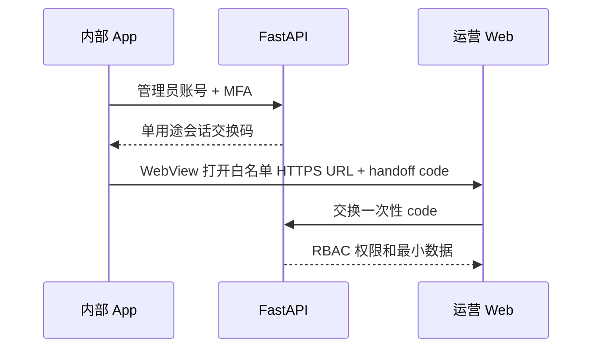

# 运营平台架构边界

日期：2026-07-27

状态：**Phase 1（运营 Web + HTTP 客户端）已完成**；**Phase 2 后端 `/admin/v1` 与本地 HTTP 联调已打通**（会话/Bearer 认证、六条管理路径）。**仍未完成**：真实 Sentry 管理 API 代理、生产 HTTPS 运营部署、App WebView handoff、跨实例持久化与生产级审计存储。

## 组成

```text
english-room-op/
├── apps/
│   └── web/               # React Web 运营管理站（Vite + React Router）
└── docs/
    ├── architecture.md
    └── ops-acceptance.md  # 本地联调与五页验收
```

运营 UI 使用 React Web，由公开 App 的通用 WebView 容器加载。运营仓库只负责 Web 应用和部署配置，不把运营页面源码打进 App；WebView 使用白名单 HTTPS URL 访问运营站。

## 实现阶段

### Phase 1（本仓库，已完成）

- 五页只读/操作 UI：总览、稳定性、房间、评分、审计（路由 `/`、`/stability`、`/rooms`、`/scoring`、`/audit`）。
- `OpsApiClient` 接口 + `HttpOpsApiClient`（默认）+ 显式 `MockOpsApiClient`（可注入 admin 头、`useOpsQuery` / `OpsQueryStatus` loading/error/重试）。
- 环境切换：默认或 `VITE_OPS_API_MODE=http` 且配置 `VITE_OPS_API_BASE_URL` 时选用 HTTP 适配器；只有 `VITE_OPS_API_MODE=mock` 时选用 Mock；缺少 Base URL 时进入配置错误态。
- 单元测试覆盖 Mock/HTTP 客户端、HTTP 头注入与页面 loading/error/重试；`typecheck` / `lint` / `build` 可在 CI 或本地验证。

**边界：** Phase 1 交付 Web 到 HTTP 的完整客户端映射与 UI，不承诺生产 Sentry、云录制或 WebView 会话交换。

### Phase 2 — 已实现（Backend + 本地 HTTP）

在 `english-room-backend`（OpenAPI 为真相源）已落地并与本仓库 **本地 HTTP E2E 验证** 的能力：

| 能力 | 状态 |
| --- | --- |
| GET `/admin/v1/metrics/overview` | 已实现 |
| GET `/admin/v1/metrics/stability` | 已实现；无真实 Sentry 时响应可为 `data_source: placeholder` |
| GET `/admin/v1/rooms` | 已实现 |
| GET `/admin/v1/scoring` | 已实现 |
| POST `/admin/v1/scoring/{taskId}/retry` | 已实现（服务端 RBAC/审计） |
| GET `/admin/v1/audit/events` | 已实现 |
| 管理员认证 | 服务端校验 **会话 Cookie** 与/或 **`Authorization: Bearer`** |
| 响应 `data_source` | `first_party` 或 `placeholder`（Web 映射为 camelCase `dataSource` 并展示页眉） |

运营 Web 默认 HTTP 模式在此阶段 **可以** 查看 Backend 返回的真实或种子数据；**不能** 据此宣称生产环境 DAU/Sentry/多实例视图已与线上一致。

### Phase 2 — 未完成（集成与生产）

- **Sentry 查询经 FastAPI 代理**（管理 Token 仅存服务端）：稳定性页在生产级 Issue/Replay 摘要 **未验收**。
- **App WebView** 白名单 HTTPS URL + `POST /admin/v1/ops/handoff` / `exchange` 一次性交接（若 Backend 已定义路径，App 与运营站部署仍需联调）。
- **生产运营站**：HTTPS 静态托管、`VITE_OPS_API_ALLOWED_ORIGINS`、CORS 凭据与 Cookie 域。
- **持久化与多实例**：指标聚合、审计日志、房间/评分状态在横向扩展下的单一真相源（本地联调可能使用内存或单库种子）。

## 数据访问层（`apps/web`）

```text
createOpsApiClient()
  ├─ VITE_OPS_API_MODE=mock → MockOpsApiClient → mock-ops-data.ts
  ├─ 默认 / VITE_OPS_API_MODE=http 且 baseUrl 非空 → HttpOpsApiClient
  └─ baseUrl 缺失 → 配置错误态（不展示 Mock）
```

`HttpOpsApiClient` 映射（与 Backend 对齐）：

- HTTP 响应体为 FastAPI admin **snake_case wire**（如 `data_source`、`unique_user_ids`、`items`）；`ops-admin-wire-mappers.ts` 在客户端边界转换为页面使用的 **camelCase UI 类型**（`dataSource`、`rooms`、`tasks`、`entries`）。Mock 模式仍直接返回 `demo` 结构，不经 wire 映射。
- HTTP 模式请求携带 `Authorization` / `X-Admin-MFA` / `X-Admin-Role`（DEV 环境变量或 runtime 注入）及 `credentials: 'include'`；由 Backend RBAC 校验。

| OpsApiClient 方法 | HTTP |
| --- | --- |
| `getOverviewMetrics` | GET `/admin/v1/metrics/overview` |
| `getStabilitySummary` | GET `/admin/v1/metrics/stability` |
| `listRooms` | GET `/admin/v1/rooms` |
| `listScoringTasks` | GET `/admin/v1/scoring` |
| `retryScoringTask` | POST `/admin/v1/scoring/{taskId}/retry` |
| `listAuditLog` | GET `/admin/v1/audit/events` |

OpenAPI 由后端发布后为接口真相源；不兼容变更使用新版本路径，并在各仓库分别迁移。

### Admin HTTP 头（联调与生产合约）

| 头 | 用途 |
| --- | --- |
| `Authorization` | 管理员会话或 Bearer（具体格式由 Backend OpenAPI 定义） |
| `X-Admin-MFA` | MFA 证明；DEV 联调可用，**完整 MFA UX 在 App/Web 未闭环** |
| `X-Admin-Role` | RBAC 角色 hint（`viewer` / `operator` / `admin`） |

运营 Web 通过 `HttpOpsApiClient` 选项或 `VITE_OPS_ADMIN_*`（仅 DEV）注入上述头，不在源码中写入真实凭证。响应体应包含 `data_source`（`first_party` | `placeholder` | Mock 为 `demo`）供页面标注数据来源。

## 构建隔离

| 变体 | 代码来源 | 分发 | 运营入口 |
| --- | --- | --- | --- |
| `production` | 仅公开 App 仓库 | App Store / Play Store | 不存在 |
| `internal-ops` | 公开 App + 通用 WebView 容器 | Ad Hoc、TestFlight 内测或企业分发 | 存在 |

运营平台实现不会进入公开仓库，也不会依赖正式包中的隐藏手势作为安全边界。

## 访问流程（目标；handoff 未验收）



运营 Web 只调用 FastAPI 管理 API。Sentry 查询由 FastAPI 使用服务端 Token 完成，Web 只接收展示所需的错误摘要、趋势和安全跳转信息。MVP 不实现 URL 加密；HTTPS、白名单、一次性交接码、服务端会话、RBAC 和审计才是安全边界，长期 Token 不进入 URL、WebView 或 App 配置。**App → WebView → exchange 链路尚未在端到端环境验收；本地 DEV 使用 admin 头或 runtime auth 桥。**

## V1 页面

1. 总览：DAU、增长率、D1/D7 留存和核心转化率。
2. 稳定性：错误趋势、受影响用户、版本分布和 Replay 跳转。
3. 房间：成员、连接、录制和房间生命周期。
4. 评分：玩家任务状态、失败原因和受控重试。
5. 审计：管理员登录、查询和写操作记录。

Mock 模式为演示数据。HTTP 模式下字段来自 Backend；稳定性页 Sentry 类字段在 `placeholder` 或 Mock 下 **不得** 表述为生产 Sentry 已接通。

## 权限（服务端 RBAC）

- `viewer`：只读指标、房间和错误摘要。
- `operator`：在只读能力外，可重试允许重试的任务。
- `admin`：管理运营账号和角色，不直接修改业务数据。

V1 不提供任意 SQL、任意后端命令、批量修改用户数据或直接读取私有音频。

本地验收步骤见 [`ops-acceptance.md`](./ops-acceptance.md)。
